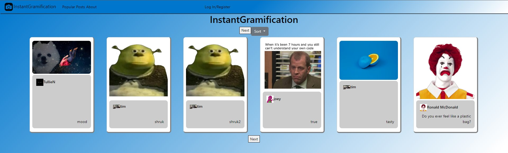
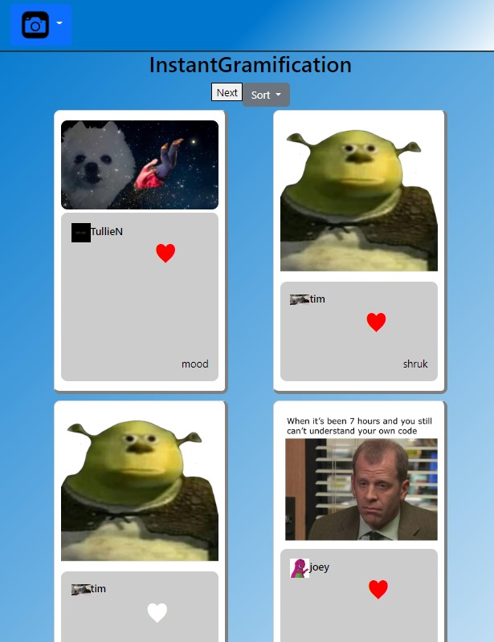
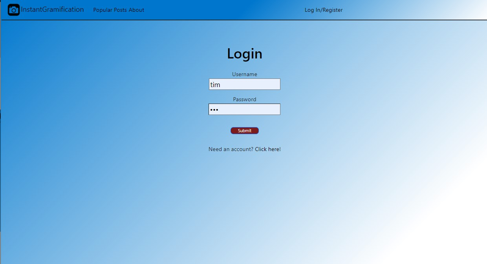
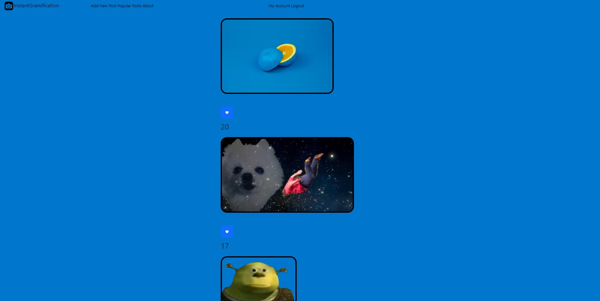
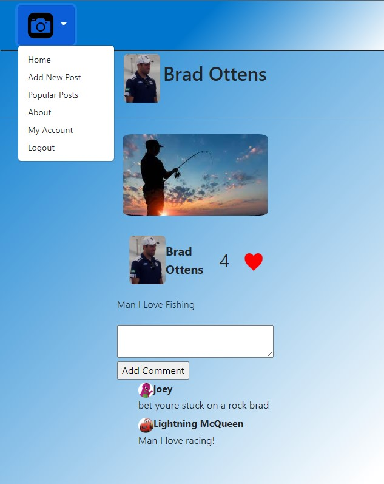
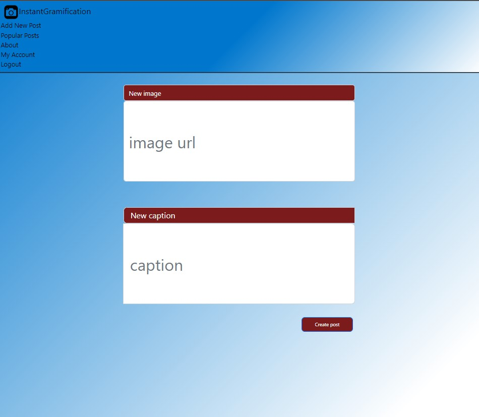
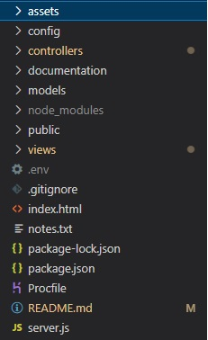
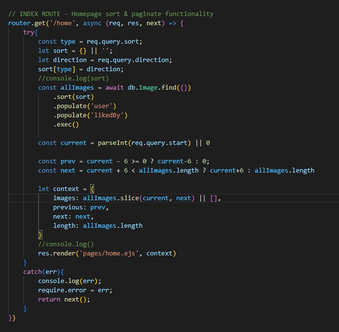
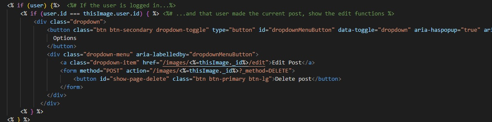

# Instant Gramification
Do you ever feel like something is missing from your (otherwise) perfect life?
- [X] Health
- [X] Happines
- [X] Friends
- [X] Family
- [X] Pets
- [X] Hobbies
- [ ] ...?

Well, friend, wonder no longer. The dopamine itch your brain has been conditioned with can now be scrached with... 
## Instant Gramification
---
 ## Table of Contents
  - [🚀️ Getting Started:](#️-getting-started)
  - [😄 User Stories](#-user-stories)
  - [👀️ Features:](#️-features)
  - [👍 Contributors](#-contributors)
  - [✨ Next Steps](#next-steps)

## 🚀️ Getting Started:

---

1. Navigate here (insert link to deployment)
2. Browse!

<details>
<summary> Want more? </summary>

3. Create an account  
4. Now you can contribute to the community by creating your own content!  

</details> 

<details>
<summary> If you're looking to run this on your own: </summary>

1. Clone this repo
2. Install dependencies (Package.json)
3. Create a .env file in the root directory that includes:
   ```
   MONGODB_URI = (the path to your own database)
   SALTNUM = (Integer value for brcypt)
   ```

</details>

## 😄 User Stories

---

<details>
<summary>How does a user interact with the site?</summary>

A user navigates to the site and sees a selection of submitted images. Browsing through them, the user can click on any image that grabs their attention to be taken to a page about that image.

* Who submitted it
* What they said about it
* How many other people have liked it
* Any comments and who made them

If a user wants more info about, they can click on any user profile name to be taken to that users profile which shows:

* The user's username and profile picture
* Any images submitted by that user

If a user navigates to a page containing an image or a comment that they have submitted, they will see some additional options; the user can edit or delete any of their own submissions.

</details>

## 👀️ Features:

---

<details>
<summary>Screenshots</summary>










</details>

<details>
<summary>Technology Used </summary>

HTMLCSSJavaScriptMongoDBMongooseNodeJS:

* bcrpyjs
* body-parser
* connect-mongo
* dotenv
* ejs
* express
* express-session
* method-override
* mongoose
* nodemon

</details>

<details>
<summary>Some things we enjoyed working on and things we learned:</summary>
- Tim  

> I really enjoyed working on routes and making different data available within each page. I learned a lot about working with databases and collaborative github workflow.

- Joey

> I really enjoyed working on the styling of the pages and making each page pop to get the users attention. I learned much more about routes and how they work thanks to my fantastic team explaining them in great detail. 

- Abtulloh

> I really enjoyed working on creating databases and configuring the databases. I learned how to populate and sort the databases that I want to display and show.

</details>

## 👍 Contributors

🎓 Abtulloh Nguyen [Github Profile](https://github.com/abtullohn)

🎓 Joey Caltabellota [Github Profile](https://github.com/joeycalt)

🎓 Tim Rathert [Github Profile](https://github.com/TimRathert)


## Next Steps

- [ ] Image uploading / hosting
- [ ] Ability to edit a user's profile picture
- [ ] The ability to follow other users and have a uniquely curated homepage of their content.
- [ ] Functionality to message other users privately
- [ ] Search posts by image description content
